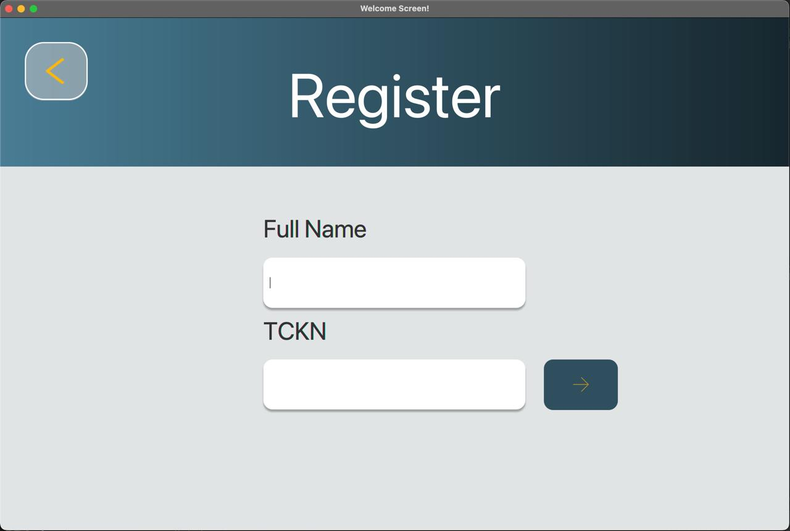

# SmartBank - Inter-Bank Platform

A JavaFX-based banking application developed as a school project. The system simulates an inter-bank platform where users can perform basic banking operations across different Turkish banks.

## Screenshots

## Features

### User Features
- Account Registration (with admin approval)
- Secure Login with TCKN
- View Account Balance
- Make Deposits
- Make Withdrawals
- Transfer Money
- View Transaction History

### Admin Features
- Secure Admin Login
- User Account Approval
- Transaction Monitoring

## Technical Stack
- Java
- JavaFX for UI
- MySQL Database
- Maven

## Project Structure
The project follows MVC (Model-View-Controller) architecture:
- `model/`: Contains entity classes (User, Admin, Transaction)
- `controller/`: Contains JavaFX controllers for different screens
- `service/`: Business logic layer
- `util/`: Utility classes including SessionManager

## Contributors
- Menekşe Uzunçelebi
- Bahra Yılmaz
- Berk Öztürk
- Ege Can Bektaş
- Mehmet Adar Kesr

## Note
This is a school project created for educational purposes. It simulates basic banking operations and may not include all security features required for a production banking system.